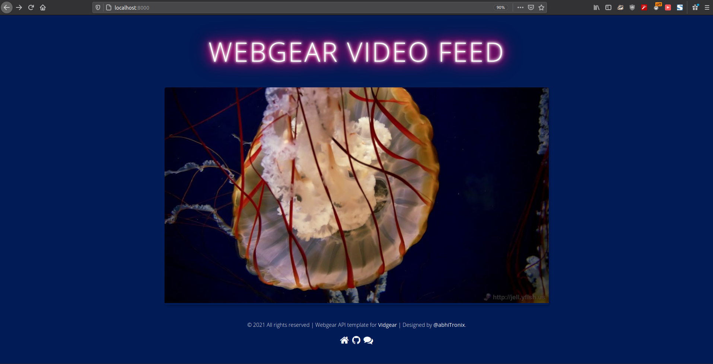

# Vidgear Vitals :rotating_light:
This repository maintains updates for additional vital binaries for [vidgear](https://github.com/abhiTronix/vidgear) APIs.

&nbsp;

### WebGear default theme



* **Description:** Default theme files for WebGear API.
* **Author:** [@abhiTronix](https://github.com/abhiTronix)
* **License:** Apache License 2.0
* **Version:** v0.1.0
* **Files MD5 Checksums:**
	```shell
	9e4d3304ac51b29b2f0d5dcb524a46bf  webgear/static/img/favicon-32x32.png
	7edae47e20a890ee49698c880b91ff14  webgear/static/css/custom.css
	ff4d0ef39ba58c23b9109b2a7f56a69e  webgear/static/js/custom.js
	6dd9d207b45a8fca70cced1403abbef6  webgear/templates/404.html
	8334bc6d4e8a05f50c14e4f59aae8d4e  webgear/templates/index.html
	0acc0384ce0422a9fee4998236676c33  webgear/templates/500.html
	0fcb62c6735ba919ff12cf46d711a194  webgear/templates/base.html
	```
