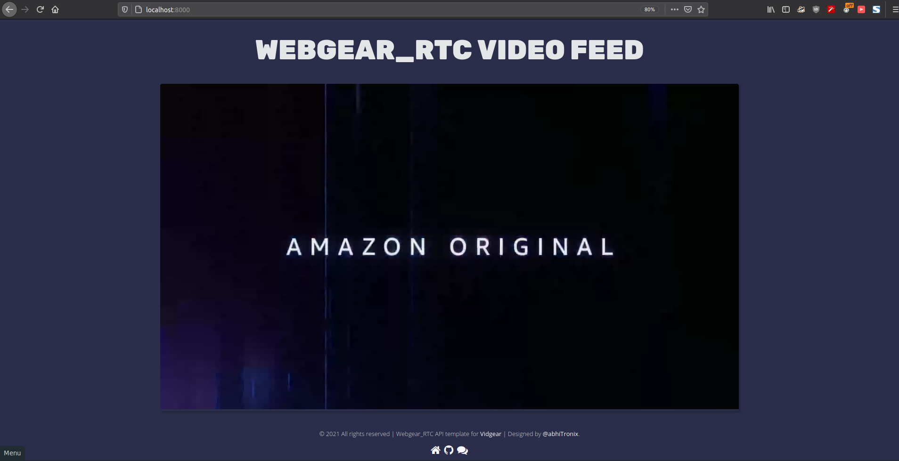

# Vidgear Vitals :rotating_light:
This repository maintains updates for additional vital binaries for [vidgear](https://github.com/abhiTronix/vidgear) APIs.

&nbsp;

### WebGear default theme


* **Description:** Default theme files for WebGear API.
* **Author:** [@abhiTronix](https://github.com/abhiTronix)
* **License:** Apache License 2.0
* **Version:** v0.1.1
* **Files MD5 Checksums:**
	```shell
	9e4d3304ac51b29b2f0d5dcb524a46bf  webgear/static/img/favicon-32x32.png
	c4655ff907a2631bfc310e19aaeec1b8  webgear/static/css/custom.css
	d45f3d577053182c162261f64ab42563  webgear/static/js/custom.js
	6dd9d207b45a8fca70cced1403abbef6  webgear/templates/404.html
	8334bc6d4e8a05f50c14e4f59aae8d4e  webgear/templates/index.html
	0acc0384ce0422a9fee4998236676c33  webgear/templates/500.html
	b5917428ca1bce7c73ffac0acf9707ce  webgear/templates/base.html
	```

### WebGear_RTC default theme



* **Description:** Default theme files for WebGear_RTC API.
* **Author:** [@abhiTronix](https://github.com/abhiTronix)
* **License:** Apache License 2.0
* **Version:** v0.1.2
* **Files MD5 Checksums:**
	```shell
	9e4d3304ac51b29b2f0d5dcb524a46bf  webgear_rtc/static/img/favicon-32x32.png
	14a7b7cbc8b46a6f5ab26ea92955dfdf  webgear_rtc/static/css/custom.css
	29da26abb4c0dff056139110b3163b11  webgear_rtc/static/js/custom.js
	6dd9d207b45a8fca70cced1403abbef6  webgear_rtc/templates/404.html
	aafa5ad625b9aa2cb8d138769ce50532  webgear_rtc/templates/index.html
	0acc0384ce0422a9fee4998236676c33  webgear_rtc/templates/500.html
	6645742f1f432a00f570ecc7af0a0fd2  webgear_rtc/templates/base.html
	```

&nbsp;

### Copyright

**Copyright © abhiTronix 2019-2020**

This library is released under the **[Apache 2.0 License](https://github.com/abhiTronix/vidgear-vitals/blob/main/LICENSE)**.